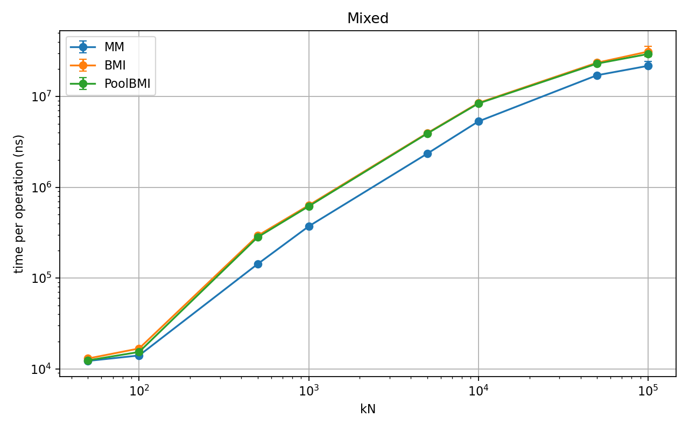
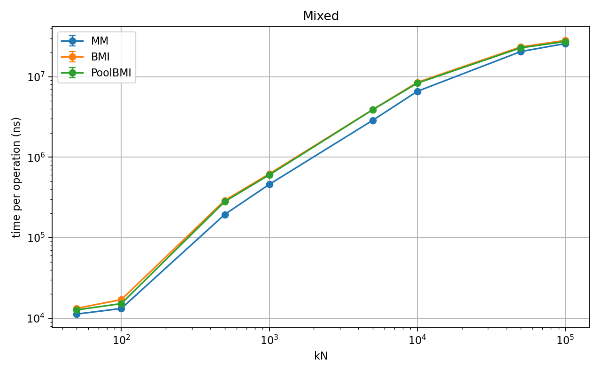
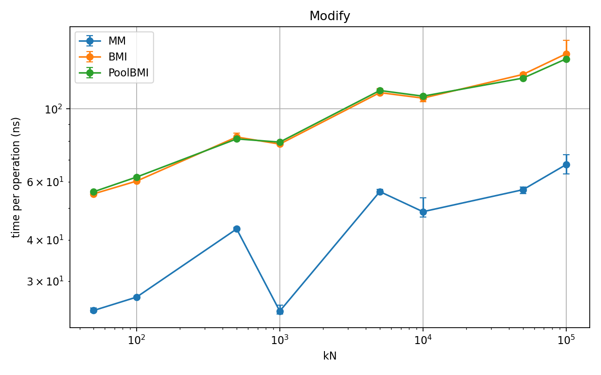
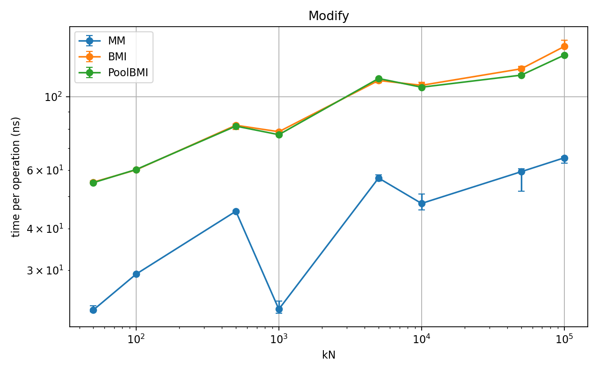
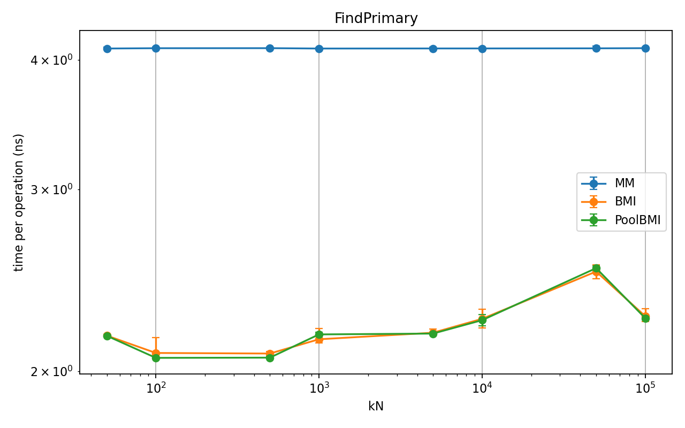
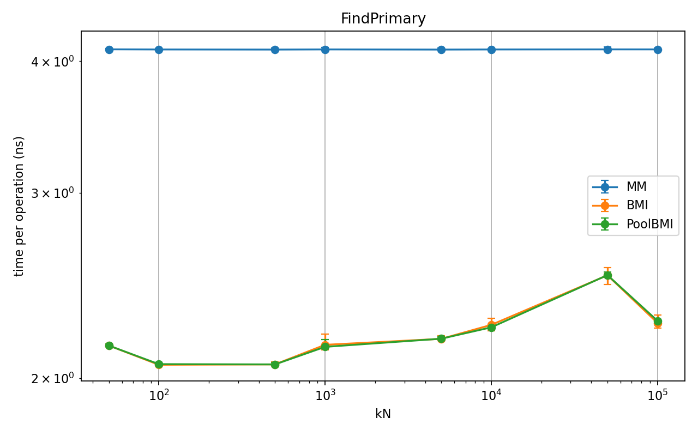
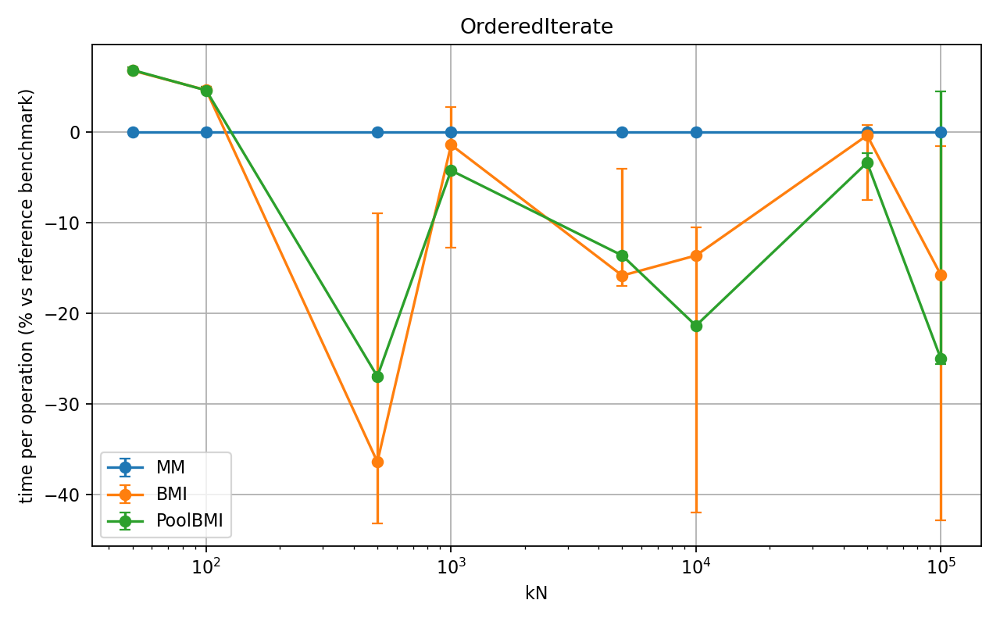
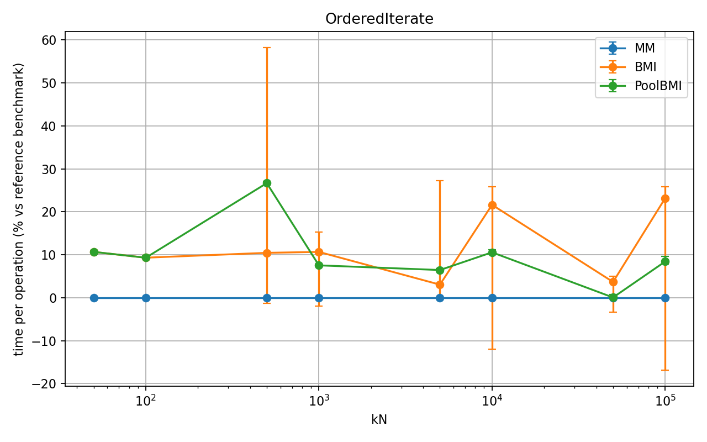

# fastmm

`fastmm::FixedSizeMultiMap` is a fixed-capacity container for the case where the same large object has to live in a few different indices at the same time, with one coherent interface and low overhead.

The target workload is not "storing a lot of stuff somehow and maximizing throughput." (although throughput may not be too bad for a broad range of workloads) It is the tighter case where the same object is hit over and over through different access patterns:

- hash lookup by a primary key
- ordered traversal by one or more fields
- non-unique grouping/range queries
- insertion-order iteration
- mixed-field access once the object is found

In other words: one object, many views, no duplicated payload, and no need to keep several containers manually in sync.

## Why this exists

If you already know the object count upper bound and you care about latency, the usual approach of "one container per query pattern" gets expensive fast:

- the payload is duplicated or indirectly owned in several places
- updates have to be mirrored across containers
- allocator traffic and fragmentation show up at the wrong time
- locality gets worse when hot objects are spread out

This library takes the opposite route:

- store each object once
- attach multiple indices to that one object (via `boost::intrusive` containers)
- choose the index set at compile time
- use a fixed-size LIFO pool for storage

That gives you a unified interface for repeated mixed queries with minimal runtime machinery.

## Design logic

The design is intentionally simple.

**1. Fixed capacity.**  
Capacity is part of the type. If the pool is full, insertion fails cleanly.

**2. Policy-based indices.**  
The index set is declared in the type. No virtual dispatch, no runtime registry, no dynamic query planner. You pay for the indices you ask for.

**3. One object, many indices.**  
The payload exists once. The indices are just alternate access paths to the same object.

**4. LIFO memory pool.**  
Storage comes from a fixed pool with LIFO reuse. The point is to avoid general-purpose allocator noise, reduce fragmentation, and keep recently-touched slots hot when the workload is bursty.

**5. Explicit indexing control when needed.**  
You can insert into the primary index only, then opt into selected secondary indices later. That matters when object construction and indexing have to be staged. This is the most significant difference in design, compared with similar libraries such as `boost::multi_index`, as we allow for partial indexing in general. 

## When it fits

This container is a good fit when:

- objects are relatively large
- the working set has a known maximum size
- the same live objects are queried repeatedly in different ways
- latency matters more than generality
- you want predictable failure on exhaustion instead of unbounded growth

Less ideal when:

- capacity is not known ahead of time
- you need arbitrary ad hoc query types
- you mainly want a drop-in STL replacement

## Quick example

The examples below use the same `Particle` type and index setup as the benchmarks and tests.

```cpp
#include <cstddef>
#include <cstdint>
#include "multimap.h"

struct Particle {
  uint64_t id;
  double x;
  double y;
  double m;

  Particle(uint64_t id, double x, double y, double m)
      : id(id), x(x), y(y), m(m) {}
};

struct Idgetter {
  using type = uint64_t;
  const uint64_t& operator()(const Particle& p) const { return p.id; }
};
struct Xgetter {
  using type = double;
  const double& operator()(const Particle& p) const { return p.x; }
};
struct Ygetter {
  using type = double;
  const double& operator()(const Particle& p) const { return p.y; }
};
struct Mgetter {
  using type = double;
  const double& operator()(const Particle& p) const { return p.m; }
};

struct IdHash {
  std::size_t operator()(uint64_t id) const {
    return std::hash<uint64_t>{}(id);
  }
};
struct IdEqual {
  bool operator()(uint64_t a, uint64_t b) const { return a == b; }
};
struct ById {};
struct ByX {};
struct ByY {};
struct ByM {};
struct BySeq {};
static constexpr std::size_t kMaxParticles = 64;

using ParticleMap = fastmm::FixedSizeMultiMap<
    Particle, kMaxParticles,
    fastmm::Unordered<Idgetter, IdHash, IdEqual, 128>,
    fastmm::Named<fastmm::Ordered<Xgetter, std::less<double>>, ByX>,
    fastmm::Named<fastmm::Ordered<Ygetter, std::less<double>>, ByY>,
    fastmm::Named<fastmm::OrderedNonUnique<Mgetter, std::less<double>>, ByM>,
    fastmm::Named<fastmm::List>, BySeq>;
```

This map has five views over the same `Particle` objects:

- index `0`: unordered unique primary index by `id`
- index `1` (`ByX`): ordered unique index by `x`
- index `2` (`ByY`): ordered unique index by `y`
- index `3` (`ByM`): ordered non-unique index by `m` (particle "mass")
- index `4` (`BySeq`): insertion-order list

We can imagine a simple game where particles can move in the two-dimensional space. Each of `x` and `y` coordinates are can not be identical for any two particles, just for simplicity in benchmarks interpretation (indeed, we can easily define composite key `(x, y)`). We will want to add/remove particles, iterate over them in different orders (inserting order, id, or ascending order in `x`/`y`), and find all particles with the same mass (an `equal_range` search for `boost::multiset`).

## Basic usage

### Insert

Insert and index into all configured indices:

```cpp
ParticleMap map;

auto it = map.insert<true>(1, 0.0, 0.0, 1.0);
if (it == map.cend()) {
  // insert failed: capacity exhausted or a unique index rejected it
}
```

If `insert<true>` hits a conflict in a secondary unique index, the insert is rolled back completely. The object does not survive in the primary index as a half-inserted entry.

Insert into the primary index only:

```cpp
auto it = map.insert<false>(99, 7.0, 8.0, 3.0);
if (it != map.cend()) {
  map.index<ByX>(*it);  // add to x-index
  map.index<BySeq>(*it);  // add to list index
}
```

That is useful when secondary indexing is conditional or staged.

### Find by primary key

```cpp
auto it = map.find_primary(42u);
if (it != map.cend()) {
  // full object is available directly
  double x = it->x;
  double y = it->y;
}
```

### Ordered iteration

Iterate by `x` in sorted order:

```cpp
for (const auto& p : map.get<ByX>()) {
  // p.x is nondecreasing
}
```

Iterate in insertion order:

```cpp
for (const auto& p : map.get<BySeq>()) {
  // insertion order
}
```

### Non-unique range queries

Get all particles with the same mass:

```cpp
auto& mi = map.get<ByM>();
auto [beg, end] = mi.equal_range(5.0);

for (auto it = beg; it != end; ++it) {
  // every particle here has m == 5.0
}
```

Walk distinct mass levels:

```cpp
for (auto it = mi.begin(); it != mi.cend(); it = mi.upper_bound(it->m)) {
  // one representative per distinct mass value
}
```

### Remove

Remove by object handle:

```cpp
auto it = map.find_primary(1u);
if (it != map.cend()) {
  map.remove(*it);
}
```

Remove by key through a unique secondary index:

```cpp
bool removed = map.remove<ByX>(3.14);  // remove by x
```

### Deindex a secondary view without deleting the object

```cpp
auto it = map.insert<true>(1, 1.0, 1.0, 1.0);

map.unindex<ByX>(*it);  // remove from x-index only

// object is still alive in the primary index
auto again = map.find_primary(1u);
```

### Project across indices

If you found an object through one index and want the iterator for another index, use `project<N>`:

```cpp
auto& mi = map.get<ByM>();
auto mit = mi.find(7.0);

if (mit != mi.cend()) {
  auto lit = map.project<BySeq>(*mit);
  if (lit != map.get<BySeq>().cend()) {
    // same object, now as a list-index iterator
  }
}
```

If the object is not currently indexed in the target index, `project<N>` returns that index's `end()`.

### Modify and reindex one field

If you mutate a field that participates in an index, reindex that index explicitly:

```cpp
auto it = map.insert<true>(1, 1.0, 3.0, 2.0);

bool ok =
    map.modify<fastmm::ReindexOnly<ByX>>(*it,
                                       [](Particle& p) { p.x = 9.0; });

if (!ok) {
  // unique-index conflict; original state was restored
}
```

For unique indices, conflicting reindex operations fail and roll back cleanly.  
For non-unique indices, reindex succeeds as expected:

```cpp
map.modify<fastmm::ReindexOnly<ByM>>(*it,
                                   [](Particle& p) { p.m = 7.0; });
```

In general, one can specify one of three reindex policies (`ReindexAll`, `ReindexNone`, `ReindexOnly`). Note that the method skips any unlinked index even if it is included in the policy. That is to say, the policy is only for optimization purpose: When you know exactly what you want to change, then specify; for explicit "reindexing", use `insert` instead.

## Alternate key declaration: `KeyFrom`

If you do not want separate getter structs, member pointers work too, one 
can also skip the tag and use the oridinal position to refer to an index:

```cpp
using ParticleMapKF = fastmm::FixedSizeMultiMap<
    Particle, kMaxParticles,
    fastmm::Unordered<fastmm::KeyFrom<&Particle::id>, IdHash, IdEqual, 128>,
    fastmm::Ordered<fastmm::KeyFrom<&Particle::x>, std::less<double>>,
    fastmm::Ordered<fastmm::KeyFrom<&Particle::y>, std::less<double>>,
    fastmm::OrderedNonUnique<fastmm::KeyFrom<&Particle::m>, std::less<double>>,
    fastmm::List>;
```

That gives the same behavior with less boilerplate when the key is just a data member.

## Semantics at a glance

- `insert<true>(...)`  
  Create object and index it into all configured indices.

- `insert<false>(...)`  
  Create object in the primary index only.

- `index<N>(obj)`  
  Add an existing object to index `N`.

- `unindex<N>(obj)`  
  Remove an object from index `N` only.

- `get<N>()`  
  Access index `N`.

- `find_primary(key)`  
  Find through the primary unordered index.

- `remove(obj)`  
  Remove the object from the container entirely.

- `remove<N>(key)`  
  Remove by key through index `N` when that operation is supported.

- `project<N>(obj_or_iterator_value)`  
  Get the iterator for the same object in index `N`, or `end()` if the object is not present there.

- `modify<fastmm::ReindexOnly<N>>(obj, fn)`  
  Mutate the object and reindex only index `N`.

## Failure model

This library aims to fail in boring ways.

- Pool exhaustion returns `end()`.
- Duplicate primary keys are rejected.
- Secondary unique-index conflicts during `insert<true>` roll back the whole insert.
- Unique-index conflicts during `modify<ReindexOnly<N>>` roll back the object state.
- `project<N>` returns `end()` when the object is not in index `N`.

That is the intended contract: no ghost entries, no half-updated indices, no dangling hooks after a normal failed operation.

## Notes

This is a fixed-size, policy-driven container for a specific low-latency workload. It is not trying to be a general-purpose database or a universal associative container. If your object count is bounded and the same objects must be hit through several access paths repeatedly, that is the use case it is built for.

## Benchmarks

Benchmarks compare three implementations against Google Benchmark on an Intel i7 (Linux):

- **MM** — `fastmm::MultiMap` (this library)
- **PoolBMI** — `boost::multi_index` with `boost::fast_pool_allocator`. The container is reserved at the beginning to minize allocation difference.
- **BMI** — `boost::multi_index` with the default allocator

The benchmark fixture uses a the above-mentioned "Particle" payload, exposing indices `{id, x, y, m}`: a primary hash index on `id`, ordered indices on `x` and `y` (for range queries), and a secondary hash index on `m`. It is enlarged by a few other fields to a full payload of `112` Bytes.

Two layout variants are tested: **aligned** (`id, x, y, m` in declaration order) and **reversed** (`id, m, y, x`), which affects cache-line layout and iterator access patterns.

Following results are time-per-operation in nanoseconds at **kN = 100,000** elements. 

### Aligned layout (id, x, y, m)

| Operation | MM (ns) | PoolBMI (ns) | BMI (ns) | Notes |
|---|---|---|---|---|
| **Create** | **478** | 508 | 522 | Insert + index all keys |
| **FindPrimary** | 4.1 | 2.3 | 2.3 | Hash lookup by `id` |
| **Modify** | **68** | 142 | 147 | Rekey across all indices |
| **Remove** | **137** | 134 | 158 | Erase + unlink all hooks |
| **BulkIterate** | **337k** | 355k | 405k | Iterate all elements |
| **OrderedIterate** | 3,769k | 2,826k | 3,175k | In-order traversal |
| **LevelWalk** | **236** | 250 | 264 | Per-node price-level walk |
| **MassRange** | 206k | 186k | 170k | Large ordered range scan |
| **Mixed** | **21.7M** | 29.3M | 31.2M | Realistic workload mix |

### Reversed layout (id, m, y, x)

| Operation | MM (ns) | PoolBMI (ns) | BMI (ns) | Notes |
|---|---|---|---|---|
| **Create** | **465** | 507 | 519 | |
| **FindPrimary** | 4.1 | 2.3 | 2.3 | |
| **Modify** | **65** | 134 | 142 | |
| **Remove** | 141 | **134** | 162 | |
| **OrderedIterate** | **2,604k** | 2,823k | 3,207k | MM wins here (see below) |
| **Mixed** | **25.8M** | 27.4M | 28.2M | |

### Key findings
**Mixed workload** is the primary story. Under a realistic interleaving of inserts, lookups, modifications, and removes, MM is consistently **30–45% faster** than BMI and **25–35% faster** than PoolBMI across all container sizes. This reflects the core design advantage: a single fixed-capacity pool means no heap allocation on the hot path, no per-element allocator overhead, and cache-warm LIFO reuse of freed nodes.

* Mixed workload performance
  

* reversed layout

**Modify** shows the starkest single-operation advantage: **~2× faster** than BMI. This is expected — a `Modify` in MM is an in-place rekey with pointer surgery on intrusive hooks. Although both MM and BMI have to erase and reinsert with allocator involvement, the target index can be specified by the user in the MM case, saving the overhead of dealing with others.

* Modify and reindex (for a single key)
  

* reversed layout

**FindPrimary** is the one consistent loss: MM runs at ~4 ns vs ~2 ns for both BMI variants, regardless of container size or layout. This appears to be an i7-specific issue (reversed on Apple M1, data not included). The likely cause is the slightly larger node size (payload + hooks) than MultiIndex, as the iteration seems basic. Further investigation pending.

* Search the primary key (hash)
  

* reversed layout

**OrderedIterate (Tree Traversal)** this is an interesting one. Here the percentage in difference is shown, as the absolute magnitude rises very quickly, making it difficult to see. From first look, it is surprising to see that PoolBMI quickly *outperforms* MM for aligned layout with increasing `kN`, while with reversed layout it is the opposite: MM is generally *faster* than PoolBMI. This turned out to be a memory effect issue: In the reversed layout, the header fields (`ByX`) accessed during ordered traversal are farther from the indexed field `x` in the struct, causing the traversal to skip two cache lines (64 Byte) per node (vs one for aligned) and improves L2/L3 utilization. This is a memory layout effect, which dominates the constant factor paricularly for large. BMI becomes very unstable in both cases, which is expected from its "allocate when needed" policy.

* Iterate the ordered index x (tree traversal)
  

* reversed layout

**PoolBMI vs BMI**: From the above results we also see that adding a pool allocator to BMI consistently improves it, sometimes matching MM on individual operations (Remove at reversed layout). However, the Mixed benchmark reliably separates them: pool allocation alone does not replicate MM's structural locality benefits. This is probably due to the clean policy based design of MM, which leads to minimal overhead at the cost of being more tailored to specific applications.

### Methodology

- Build: `-O3`, single-threaded
- Warmup: Google Benchmark default (1 second)  
- Repetitions: 200 per configuration, median reported
- Error bars: p5/p95 across repetitions
- Sizes: N ∈ {50, 100, 500, 1k, 5k, 10k, 50k, 100k}
- Machine: Intel Core i7 (Linux); Apple M1 results omitted for platform consistency

Raw JSON results are in `benchmarks/data/`.
